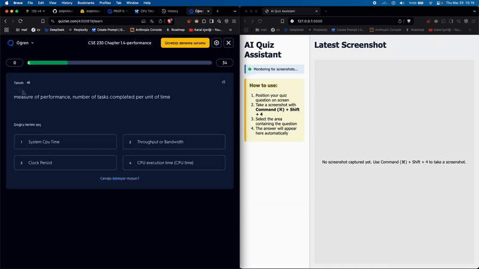

# AI Quiz Answering App

This application uses Google's Gemini 2.0 Flash model to process quiz questions from screenshots and provide answers. The app monitors for macOS screenshots, processes them with the Gemini multimodal model, and displays the answers in real-time.

## Demo



## Features

- Automatic detection of macOS screenshots (using Command + Shift + 4)
- Image processing using Gemini 2.0 Flash multimodal model
- Real-time answer generation for quiz questions
- Simple and intuitive user interface
- Answer history displayed in the sidebar

## Requirements

- macOS (for the native screenshot functionality)
- Python 3.8 or higher
- Google API key with access to Gemini models

## Detailed Installation Guide


### 1. Getting the Application

#### Using Git 
1. Install Git if you haven't:
   - Visit https://git-scm.com/download/mac
   - Download and install Git
2. Open Terminal and run:
   ```bash
   git clone https://github.com/yourusername/ai-quiz-answering-app.git
   cd ai-quiz-answering-app
   ```

### 2. Setting up Python Environment

Choose ONE of the following methods:

#### Option A: Using venv (Python's built-in virtual environment)
```bash
# Create virtual environment
python3 -m venv venv

# Activate virtual environment
source venv/bin/activate

# Install dependencies
pip install -r requirements.txt
```

#### Option B: Using Conda(Recommended)
Open Terminal and run:
   ```bash
   # Create conda environment
   conda create -n quiz-app python=3.8
   
   # Activate conda environment
   conda activate quiz-app
   
   # Install dependencies
   pip install -r requirements.txt
   ```

### 3. Setting up Google API Key

1. Visit Google AI Studio: https://makersuite.google.com/app/apikey
2. Sign in with your Google account
3. Click "Create API Key"
4. Copy your API key
5. Create a `.env` file in the application folder:
6. Open `.env` file in any text editor and add your API key:
   ```
   GOOGLE_API_KEY=your_api_key_here
   ```

### 4. Configuring macOS Screenshot Settings

1. Press `Command (⌘) + Shift + 5` to open Screenshot toolbar
2. Click "Options"
3. Under "Save to", select "Desktop"
4. Make sure "Show Floating Thumbnail" is unchecked for instant processing
5. Close the options menu

## Usage

1. Start the application:
   ```bash
   # If using venv:
   source venv/bin/activate
   python app.py

   # If using conda:
   conda activate quiz-app
   python app.py
   ```

2. Open your web browser and go to `http://127.0.0.1:5000/`

3. The application will open with a simple interface showing:
   - A sidebar with status indicator and answer history
   - A main panel showing the latest processed screenshot

4. To analyze a quiz question:
   - Position the quiz question on your screen
   - Take a screenshot using macOS native screenshot tool (Command + Shift + 4)
   - Select the area containing the question
   - The application will automatically detect the new screenshot, process it, and display the answer

## Command Line Interface

For a simpler interaction, you can also use the CLI version:

```bash
python cli.py
```

The CLI version will monitor for screenshots and output the answers directly in the terminal.

## How It Works

1. The application monitors your Desktop folder for new screenshot files
2. When a macOS screenshot is detected (files starting with "Screenshot"), it's processed
3. The Gemini 2.0 Flash model analyzes the screenshot to extract the question
4. The model generates an answer based on its understanding of the question
5. The answer is displayed in the web interface or CLI

## Limitations

- The accuracy of the answers depends on the capabilities of the Gemini 2.0 Flash model
- The application works best with clear, well-formatted quiz questions
- Processing time may vary based on your internet connection and the complexity of the image 