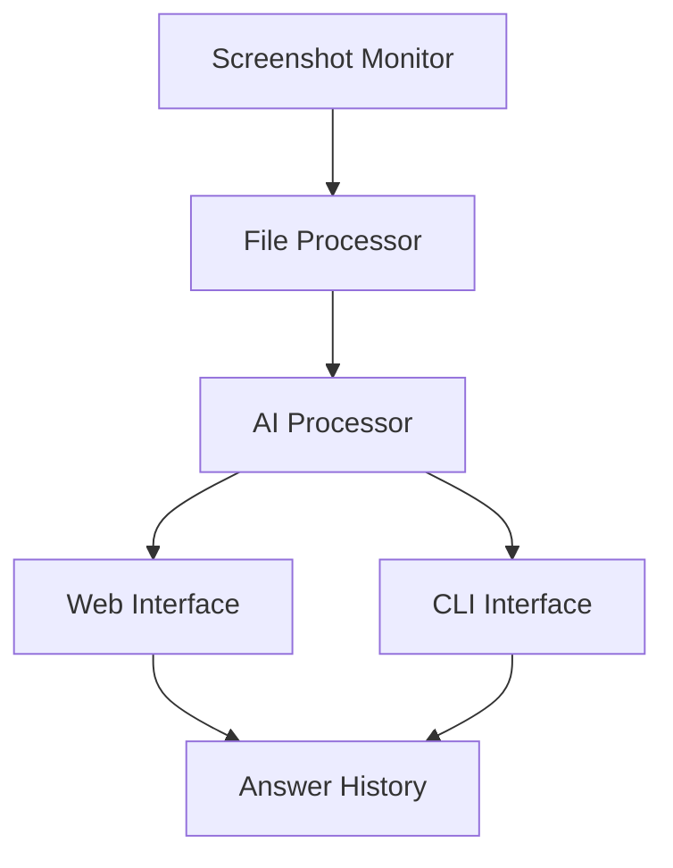

# System Patterns: AI Quiz Answering App

## System Architecture

### Component Overview

## Key Components

### 1. Screenshot Monitor
- Uses Watchdog library for file system events
- Monitors Desktop directory for new screenshots
- Filters for macOS screenshot filename patterns
- Triggers processing pipeline on new files

### 2. File Processor
- Validates screenshot files
- Reads image data
- Prepares images for AI processing
- Manages file cleanup

### 3. AI Processor
- Integrates with Gemini 2.0 Flash model
- Handles multimodal processing
- Generates answers from image input
- Manages API communication

### 4. Web Interface
- Flask-based web server
- Real-time updates using automatic refresh
- Displays current and historical answers
- Shows system status

### 5. CLI Interface
- Alternative terminal-based interface
- Direct output of answers
- Minimal but functional design
- Status indicators in terminal

### 6. Answer History
- In-memory storage of past answers
- Maintains session history
- Accessible from both interfaces

## Design Patterns

### 1. Observer Pattern
- File system monitoring
- Event-driven processing
- UI updates

### 2. Pipeline Pattern
- Screenshot detection
- Image processing
- AI analysis
- Answer generation

### 3. Factory Pattern
- Interface creation (Web/CLI)
- Processor initialization

### 4. Singleton Pattern
- AI model instance
- Configuration management
- History storage

## Technical Decisions

### 1. Framework Choices
- Flask for lightweight web server
- Watchdog for reliable file monitoring
- Python for cross-component compatibility

### 2. Processing Flow
- Asynchronous file monitoring
- Synchronous AI processing
- Real-time UI updates

### 3. State Management
- In-memory storage for session data
- No persistent database required
- Simple state management

## Component Relationships

### Data Flow
1. Screenshot creation triggers file event
2. File processor validates and prepares image
3. AI processor generates answer
4. Interfaces updated with new data
5. History updated with new entry

### Communication
- File system events for detection
- Function calls for processing
- Web routes for interface updates
- Standard output for CLI

## System Constraints
- Single user operation
- Local execution only
- Session-based history
- macOS environment dependency 